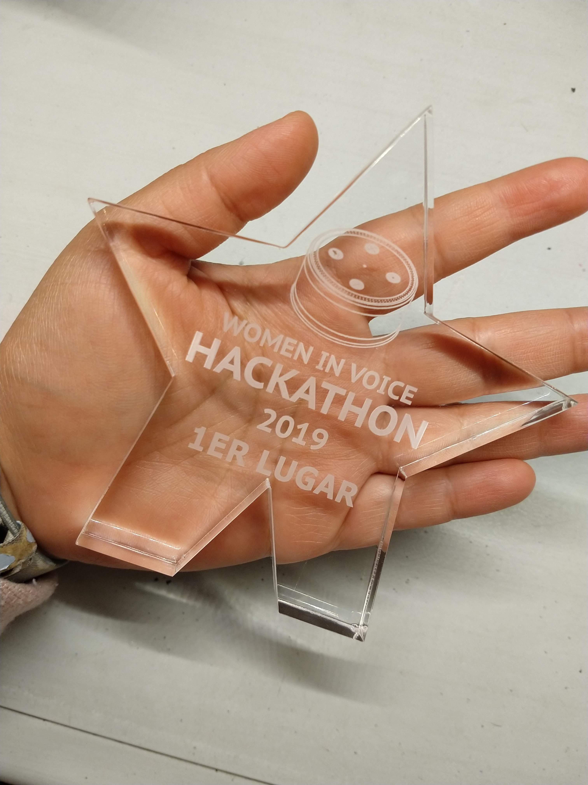
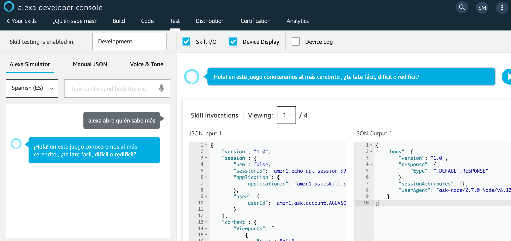

# ¿Quién sabe más?

Esta skill de Alexa fue diseñada y desarrollada durante el Hackhaton *Women in Voice Amazon Edition* que se llevo acabo el 14 de noviembre de 2019 en CDMX.

Como resultado se obtuvo el primer lugar.

El reto era de temática abierta.

## ¿Por qué un juego?

La propuesta fue crear un juego en el que pudieran puedieran existir múlptiples participantes. Alexa es considerado en gran medida un dispositivo que funciona como asistente para diversas tareas, se espera que la interación sea persona - Alexa. Sin embargo, para este proyecto la intención era que Alexa funcionase como un punto de encunetro, como una conexión entre varios individuos y que permitiera la integración a la vida cotidiana de este tipo de tecnolgías de una forma más amena.

El juego consiste en un conjuto de preguntas que Alexa hará y que los participantes responderán, será según la respuesta del participante la acción. Si el participante no responde correctamente Alexa le dará la opción de pistas, si aún así no adivina, el participante deberá beber un shot. Si la respuesta es correcta, otro participante continúa.

Para esta skill se precisó que el tono fuera casual, divertido, irreverente. El léxico que se utilizó siguió estas pautas.  

## Conversation design

## Intents && Utterances 

Para este MVP se definieron los siguientes *intents* con sus respectivas *utterances*:

| Intents                     |      Utterances |
|-----------------------------|-----------------|
| DifficultIntent             |'dificilito' , 'dificil
|EasyIntent                   |'facilisimo', 'facilito', 'facil'
|SuperDifficultIntent         |'muy dificil', 'super dificil', 'redificil'
|EntroIntent                  |'si','sip','simona la mona', 'venga pues'
|NoIntent                     | 'que no','nop', 'mejor luego'
|NoUnderstandIntent           |'o sea como', 'otra vez', 'hablas muy rapido', 'como dijiste'
|TitanicCorrectIntent         | 'titanic','taitanic'
|NoIdeaIntent                 | 'dame otra pista','no me aacuerdo', 'quien sabe', 'ni idea'

 

## Código

Una vez diseñada la conversación se desarrollo la skill con JavaScript en la alexa developer console. El codigo se puede ver [aquí](https://github.com/sofiamejiamuro/quien-sabe-mas/blob/master/index.js).

## Skill ¿Quién sabe más?

A continuación se puede escuchar un ejemplo de la interación personaa - Alexa en este juego.

[flujo-1](./assets/sounds/Quien-sabe-mas-1)